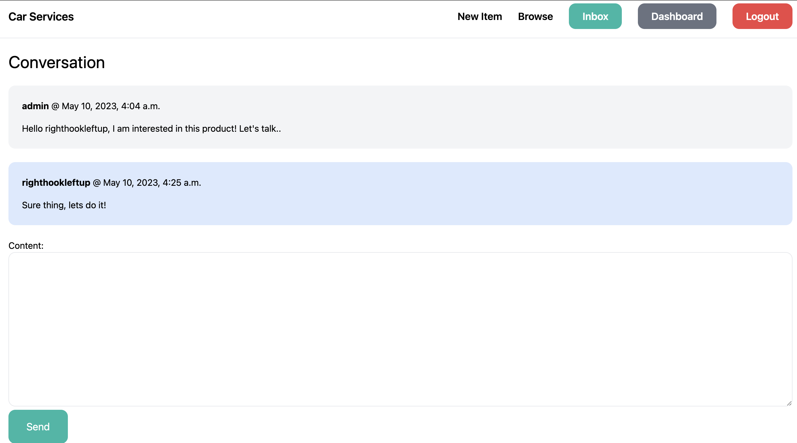

# Car Services Marketplace App Using Django (only)

## Features:

A django application for a marketplace of car services offered by individuals. Simple application to help me understand the skeletons of django and how it works. Here are some of the features:

- **Authentication**: Signup, Login, Logout

- **Dashboard**: Dashboard view to see user's registered items

- **Browse Items**: Simple searching for available items in the database using filters for key words and categories.

- **Add/Edit/Delete item**: Allow users to add/edit/delete items to the marketplace.

- **Related Items**: Give users other related items when browsing some individual item.

- **Conversations**: Allows users to contact sellers by enabling "Inbox" and "Personal Message" features.

